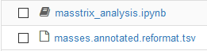
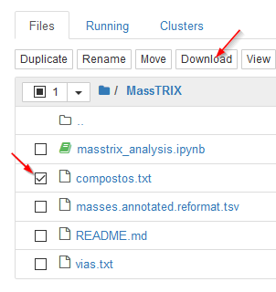

## Extração de vias e compostos dos resultados de busca no MassTRIX.

O _notebook_ `masstrix_analysis.ipynb` executa a extração da informação sobre
compostos e vias metabólicas dos resultados da busca no servidor MassTRIX. O _notebook_
está preparado para se aplicar a um ficheiro de exemplo, mas é facilmente adaptável
para outros resultados da análise. As anotações no _notebook_ dão indicações sobre como adaptar.

Como resultado da análise são gerados dois ficheiros: : `compostos.txt` e `vias.txt`. Estes ficheiro contêm a informação extraída, são ficheiros de texto com colunas separadas por _tab_ (`\t`) e podem ser abertos no MS-Excel.

Para usar o notebook sem uma instalação do Python e da plataforma Jupyter, o sistema _Binder_
permite criar uma sessão temporária para executar o notebook num conjunto de resultados.

### Instruções para executar o _notebook_ no sistema _Binder_

Visite o link

(espere um pouco até iniciar o espaço de trabalho _Binder_)

De seguida, quando o Jupyter iniciar,

1. Mude para a pasta MassTRIX

2. Faça o _upload_ do ficheiro de dados.  

3. Abra o notebook `masstrix_analysis.ipynb`

4. Faça algumas alterações ao notebook:

    4.1. Verifique se a referência ao nome do ficheiro de dados está correta. Se não estiver, corrija, está logo na primeira célula de código.

    4.2. Uma das células mostra os resultados obtidos para alguns compostos e vias. Esta célula aplica-se aos dados de exemplo. Retire esta célula ou adapte aos seus dados (por exemplo, mude o Id ddos compostos).

5. Corra todas as células (Cell -> Run all).

6. Na lista de ficheiros da pasta de trabalho foram criados 2 ficheiros: `compostos.txt` e `vias.txt`. Faça o _download_ destes ficheiros. Eles contêm a informação sobre compostos e vias que foi extraída do ficheiro de dados. 

7. Estes ficheiros podem ser abertos no Excel. Para isso, abra primeiro o Excel e depois, abra os ficheiros. Deve indicar que os ficheiros têm header (cabeçalho) e as colunas estão separadas por `TAB`.

